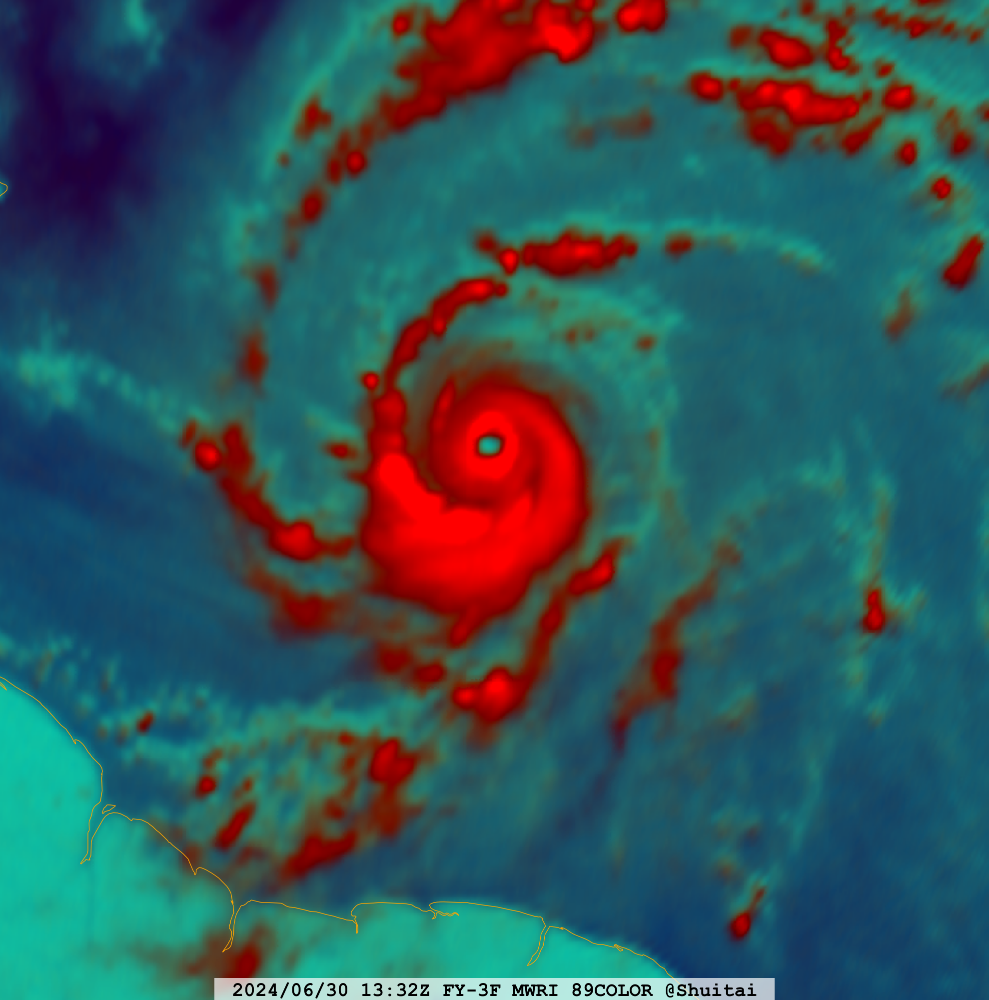

# FY3-Reader
A package includes FY-3 (FengYun-3) MWRI L1 (FY-3D/G) &amp; PMR L2 (FY-3G) reader.

## Install
**NOTE: Following commands run on Linux System (Debian, Fedora, Ubuntu, CentOS, etc.) only**

For the first time using the package, please run following commands:
```Bash
pip install Cython numpy==1.24.2
PATH_NUMPY=`pkg-config --cflags numpy` # get the numpy libraries path
PATH_NUMPY=${PATH_NUMPY/-I/}
PATH_NUMPY=${PATH_NUMPY/% /}
export C_INCLUDE_PATH=$PATH_NUMPY:$C_INCLUDE_PATH
cythonize -a -i FY3-Reader/fy3Reader/bicubic_interp.pyx
```

## Package Usage
```Python
# Read a FY-3D MWRI L1 file
from fy3Reader.mwri_l1 import FY3D_MWRI_L1

mwri_l1 = FY3D_MWRI_L1("FY3D_MWRIA_GBAL_L1_20240530_0405_010KM_MS.HDF")
mwri_l1.load('89_color')
mwri_l1.crop((25, 35, 135, 145))
mwri_l1.resample(resampler='bicubic', to_shape=(2000, 2000))
lons, lats = mwri_l1.get_lonlats()
data_projected = mwri_l1.values
```

## Run Full Test
```Bash
cd FY3-Reader
python test.py
```

## Test Results


